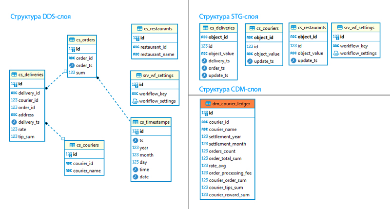

### 1. Список полей, которые необходимы для витрины cdm.dm_courier_ledger: 
   0. `id` — идентификатор записи
   1. `courier_id` - ID курьера. берем из dds.dm_courier
   2. `courier_name` - Ф.И.О. курьера. берем из dds.dm_courier
   3. `settlement_year` - год отчёта. вытаскиваем из dds.dm_timestamp
   4. `settlement_month` - месяц отчёта. вытаскиваем из dds.dm_timestamp
   5. `orders_count` - количество заказов за период (месяц) из dm_orders
   6. `orders_total_sum` - общая стоимость заказов из dm_delivery
   7. `rate_avg` - средний рейтинг курьера из dm_delivery
   8. `order_processing_fee` - сумма, удержанная компанией за обработку заказов
   9. `courier_order_sum` - сумма, которую необходимо перечислить курьеру за доставленные заказы
   10. `courier_tips_sum` - сумма чаевых, которую пользователи оставили курьеру
   11. `courier_reward_sum` - сумма, которую необходимо перечислить курьеру

### 2. Список таблиц в слое DDS, из которых вы возьмёте поля для витрины. 
   - dds.cs_orders  - создаётся заново
   - dds.cs_timestamps - создаётся заново
   - dds.cs_deliveries - создаётся заново
   - dds.cs_couriers - создаётся заново
   - dds.cs_restaurants - создаётся заново
   

### 3. На основе списка таблиц в DDS составьте список сущностей и полей, которые необходимо загрузить из API.  
Из API мы воспользуемся методами `/couriers`, `/deliveries` и `/restaurants`.
   - stg.cs_deliveries, данные из метода `/deliveries` в источнике
      id serial4 NOT NULL,
	  object_id varchar NOT NULL,
	  object_value text NOT NULL,
	  delivery_ts timestamp NOT NULL,
	  order_ts timestamp NOT NULL,
	  update_ts timestamp NOT NULL
	
   - stg.cs_couriers, данные из метода `/couriers` в источнике
 	  id serial4 NOT NULL,
	  object_id varchar NOT NULL,
	  object_value text NOT NULL,
	  update_ts timestamp NOT NULL
	
   - stg.cs_restaurants, данные из метода `/restaurants` в источнике
	  id serial4 NOT NULL,
	  object_id varchar NOT NULL,
	  object_value text NOT NULL,
	  update_ts timestamp NOT NULL

### Структура Слоёв
